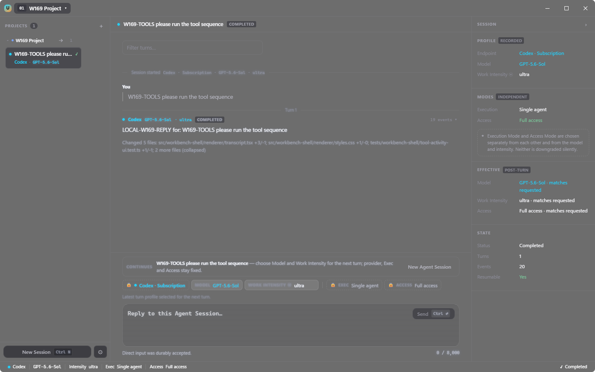

# Synchronized Intellect Network

One Windows app for the coding agents you already pay for — Codex CLI and Claude Code —
organised by project, with conversations that survive closing the app.

It drives the vendors' own command-line tools on your machine, under credentials you
already hold. It does not resell anyone's model.



## Run it

Download this repository and double-click **`start.bat`**.

No toolchain has to be installed first. When `node` is missing or older than 22.5, the launcher
downloads the official Node 24.20.0 LTS zip from `nodejs.org`, verifies its SHA-256 against
the official manifest *before* extracting or running anything out of it, and keeps it in
`%LOCALAPPDATA%\unified-agent-workbench\runtime\node`. It then installs the dependencies
from the lockfile when they are missing or out of date — through Node's bundled `corepack`
when pnpm is not on your PATH — builds the three bundles, and starts the app. Nothing is
installed globally, no system setting changes, and the only PATH that moves is that
window's. Every failure says what it looked for, where it looked, and where to get it, and
the window stays open so you can read it.

You need Windows, a network connection for the first run, and at least one of
[Codex CLI](https://github.com/openai/codex) or
[Claude Code](https://claude.com/claude-code) — those are the tools the app drives. It
finds them; it does not install or authenticate them.

Every argument goes straight through to Electron, so a throwaway profile works:

```
.\start.bat --user-data-dir=C:\sin-throwaway
```

The leading `.\` is not decoration: neither PowerShell nor a hardened `cmd` searches the
current directory for a command to run.

## What it does

- **Two runtimes, one interface.** Codex and Claude Code both hold a real conversation:
  start a session, send a turn, send another, get the reply attributed to the model that
  produced it.
- **Conversations survive a restart.** Close the app, reopen it, continue the same session
  on either runtime.
- **Projects, not folders.** A project is a local directory plus the agent sessions and
  work history attached to it.
- **You can see what the agent is doing.** `Bash npm test`, `Read foo.ts` — the tool call
  it is actually making, not a motionless "calling a tool". Recognisable credentials in the
  command line become `<redacted>` before anything is displayed.
- **Which files a Codex turn changed.** `Changed 3 files: a.ts +12/-4; b.ts; c.ts +1/-0`,
  computed from the real diff. The diff body never leaves the adapter, and a file whose
  counts cannot be derived is listed by path alone rather than with an invented number.
- **Failures say what failed.** Sixteen named reasons, each with what to check next. A
  failure that arrives with no recorded category says exactly that instead of guessing one.
- **Token usage and reset times** for Claude · Subscription, the one channel that reports
  them. The others say "not provided by this channel" — which is not the same sentence as
  "Unknown", which is not 0%.
- **`/auto-continue 3`** on the first line, the instruction on the second, repeats that
  instruction for up to 10 turns. Each step waits for the previous turn to be durably
  recorded as completed and still resumable; anything else ends the run and reports which
  step stopped and why. There are no retries.
- **A bounded pause when quota runs out.** A GLM Coding Plan turn refused before any of it
  ran parks that session for at most 24 hours, and you resume it. Nothing calls the
  provider when the deadline passes.
- **Model and effort per session,** read from the vendor's own tool at run time on the
  subscription endpoints, in that vendor's own words. The API-key endpoints carry a curated
  catalog instead; a zero-inference `GET /models` at startup keeps the GLM and DeepSeek
  ones current.
- **Durable local history.** Sessions, turns and their outcomes are written to a local
  SQLite ledger, one per project.
- **Windows-native shell.** Custom title bar, tray, themes (including a light and a dark
  acrylic, and a CRT skin).
- **English and Simplified Chinese,** switchable at run time and kept with your appearance
  preferences.

## Your credentials

The two **subscription** endpoints, Codex · Subscription and Claude · Subscription, never
ask for an API key and never broker your sign-in: authentication stays inside the vendor's
own tool, where you already set it up. Before spawning the Claude CLI the app *deletes*
`ANTHROPIC_API_KEY`, `ANTHROPIC_AUTH_TOKEN`, `ANTHROPIC_BEARER_TOKEN` and
`CLAUDE_CODE_OAUTH_TOKEN` from the child's environment, so a key that happens to be in your
shell cannot quietly become the thing that pays for the turn. A Codex subscription session
inherits your environment unchanged; only its sign-in launch is cleansed that way.

The six **API-key** endpoints — GLM Coding Plan, Kimi Code, Kimi Platform, DeepSeek API,
Claude API, Codex API — do ask for a key, because there is nothing else to ask for. You
paste it in Settings; it is encrypted through Electron's `safeStorage` (DPAPI on Windows)
under `%APPDATA%\synchronized-intellect-network`, and if Windows reports encryption
unavailable it is kept in memory for that run rather than written in the clear. Each key
reaches only its own endpoint: the child environment is cleansed of every ambient vendor
credential first, then given exactly that one key under the one variable that CLI reads.

There is no server behind the app and no telemetry. Your turns reach the vendor through the
vendor's own CLI, exactly as they would if you ran that CLI in a terminal. The app opens a
connection of its own in two places only, both to an endpoint you configured a key for and
neither one carrying a prompt: that `GET /models` refresh, and the "test connection"
button in Settings.

## Limits

- Windows only, by construction.
- Early. One person's project.
- No signed or distributed package; `pnpm workbench:package:windows` builds an unsigned
  local one.
- The first run needs the network — that is where Node and the dependencies come from.
- The launcher keeps `%LOCALAPPDATA%\unified-agent-workbench\runtime\node`. Beyond that,
  this directory and the package managers' own caches, nothing on the machine changes.
- Sessions created before the restart fix cannot be resumed after a restart: their native
  identity was never recorded, and no migration is possible.
- A session recorded against a model the vendor has since retired cannot be continued.
  Start a new one; the app points you there.

## How it is put together

- **Electron main** owns the project registry, the per-project SQLite ledger, and every
  capability that touches the filesystem or spawns a process.
- **A Solid renderer** owns the UI and holds no privileged capability; it talks to main
  across a narrow preload bridge.
- **Adapters** wrap each vendor's CLI over its own protocol. An adapter owns transport and
  native session identity; it never owns credentials.
- **Boundaries separate drift from doubt.** A new catalog field, an unfamiliar settings
  source or an unknown Codex item type is admitted and named on the console as
  `CLAUDE_CATALOG_DRIFT` / `CODEX_CATALOG_DRIFT`, so a CLI update does not take the product
  down with it; a genuinely malformed model row is quarantined by itself and the rest stay
  usable. What stays fail-closed is what a wrong guess would make unsafe: an unrecognised
  permission mode refuses to start the session, a reply that cannot be matched to this
  session and turn is never counted as one, an answer arriving under an unrecognised phase
  is not treated as the answer, and the renderer is handed nothing that was not rebuilt
  field by field.

Two files are worth reading before the code:

- [`CONTEXT.md`](CONTEXT.md) — the vocabulary. Every noun in this codebase (Project, Agent
  Session, Session Profile, Work Intensity, Access Mode…) is defined there, with the words
  the project deliberately avoids.
- [`docs/adr/`](docs/adr) — 22 architecture decision records, in the order they were taken.

`.gitattributes` sets `* -text`, so Git never translates line endings in either direction.
Do not remove it. A great many tests here read source files as text and assert on exact
strings, and `core.autocrlf` is `true` by default on plenty of Windows installs — without
this file, a fresh clone would rewrite every checked-out file and the failures would look
like wholesale corruption rather than like a line-ending setting.

## Develop

```
pnpm install --frozen-lockfile
pnpm workbench:start
```

`workbench:start` builds the three bundles and launches Electron. `pnpm build` builds
without launching, producing `dist/main/main.js`, `dist/preload/preload.cjs` and
`dist/renderer/index.html`.

```
pnpm typecheck
pnpm test
```

`pnpm test` is the supported gate — it pins `--test-concurrency=1` and lists its globs
explicitly; bare `node --test` from the repository root is not supported. There is a
second, separate gate that drives a real Chromium and measures rendered pixels:

```
pnpm test:rendered-surfaces
```

It is sensitive to display resolution, so CI enlarges the runner's virtual display first.
CI runs every job on `windows-latest`.

The suite tells you what it does not cover: the visual and copy work is specified against a
design corpus that is not published, so the tests that read it are not in this tree.
`tests/harness/public-suite-scope.test.ts` names every one of them with its reason and
proves each is genuinely absent, rather than reporting green over a silence.

## Feedback

Open an issue. The most useful report says what you did, what you expected, what happened,
and which vendor CLI and version you were driving.

## License

[MIT](LICENSE).
